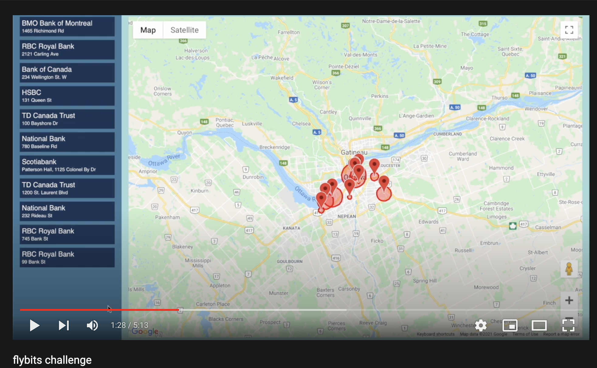
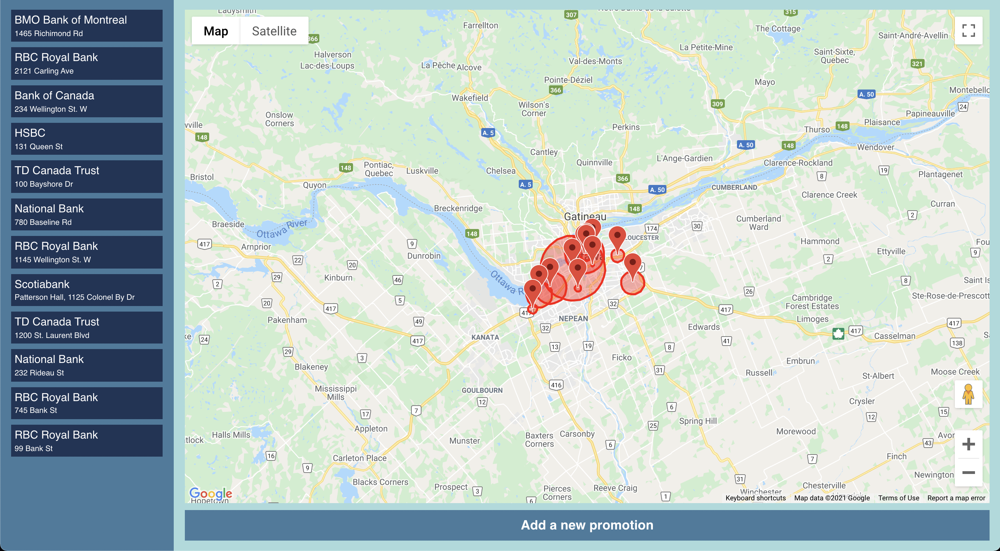
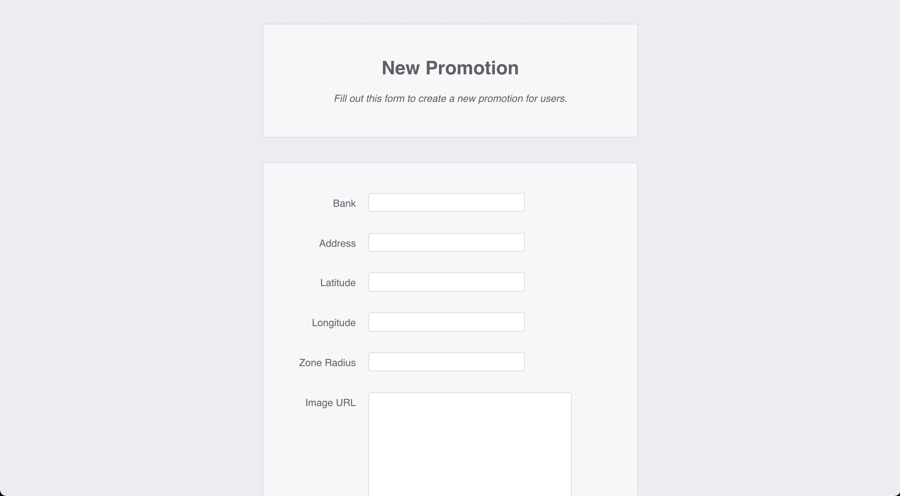
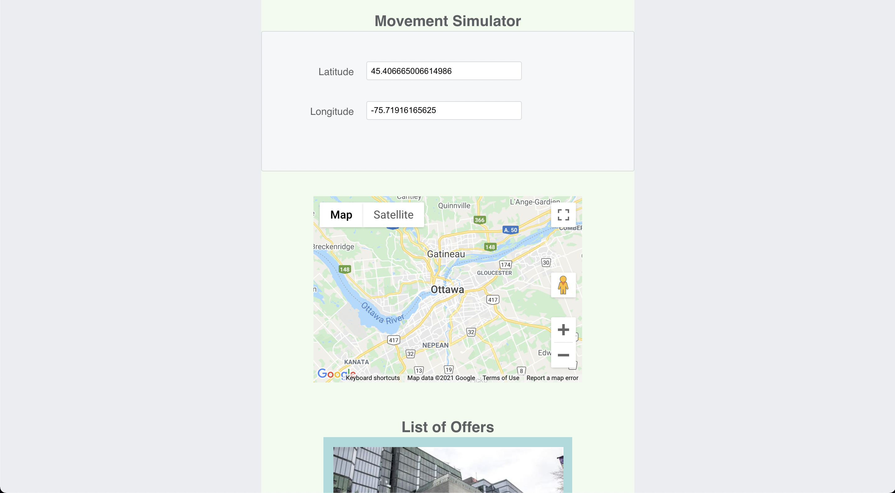

# Flybits Challenge
This app allows marketers to create offers for users and for user to view these offers.

## Summary Video

Watch the summary video [here](https://youtu.be/b4K0Is27qF0)

## Screenshots
### Marketer UI

### Add New Promotion/Offer

### User Sees Relevant Offers Based On Location

## Setup
1. git clone this repo to your system
1. [create an api key](https://developers.google.com/maps/documentation/javascript/get-api-key) for google maps.
1. copy the maps api key into your local .env file (use the template in .env.example file)
1. setup a project in your firebase console, and register a web app.
1. setup firebase firestore and storage in the firebase console. 
1. copy the firebase config of your project into your local .env file (use the template in .env.example file)
1. npm install -g firebase-tools && firebase login if using firebase for the first time on your system.
1. sample data in /sample_data/offers.js can be used while creating new offers
1. npm run build to build the react app
1. provide your firebase project-name in .firebaserc
1. firebase deploy --only hosting to deploy the app to your firebase hosted domain. 

## Stack
This project was initialized with [Create React App](https://github.com/facebook/create-react-app).

Styling and layout was done with [node-sass](https://github.com/sass/node-sass).

[Google Maps Javascript API](https://developers.google.com/maps/documentation/javascript/overview) was used for map functionality.

[Firebase](https://firebase.google.com/) was used for storing files/images, data/documents and for user authentication. 